# German Traffic Signs Detection

## Introduction
This project target is to train a model to detect German 43 classes traffic signs with [GTSDB dataset](http://benchmark.ini.rub.de/?section=gtsdb&subsection=dataset) and [Tensorflow object detection API](https://github.com/tensorflow/models/tree/master/research/object_detection).

This project is continue of [Traffic Signals Detect FC2017](https://github.com/xfqbuaa/Traffic-Signal-Detect) and base of further Chinese traffic signs detection including traffic lights.

Traffic signs detection is the basic of self driving car and should be optimized separately for different countries since there are different traffic signs.

Different from GTSDB competition to detect traffic signs category, this project will detect detail classes for total 43 traffic signs and evaluate model detect performance.  

Two COCO-trained models were used to fine tune, detail you can find [model zoo](https://github.com/tensorflow/models/blob/master/research/object_detection/g3doc/detection_model_zoo.md).
* ssd_inception_v2_coco
* faster_rcnn_inception_v2_coco

To simplify two trained model with 'ssd' and 'faster' below.

To choose ssd and faster trained model for consideration of accuracy and speed, especially the real time demand of traffic signs detection for self driving car.  

Focal loss has been applied to ssd model in order to deal with data imbalance. Detail can reference [lijiancheng0614 github](https://github.com/lijiancheng0614/tensorflow_object_detection) and [paper](https://arxiv.org/pdf/1708.02002.pdf).

In one word, Traffic signs detection extremely depend on dataset size and distribution with current deep learning models.

## Author
Writer successfully got the Self-Driving Car Engineer Nanodegree from Udacity and is learning Andrew Ng's Deep Learning class in Coursera.

Now I am putting effort into self driving car simulation in Chinese traffic scene, traffic signs, road signs detection.

## Performance

### Evaluation metrics
The commonly used mAP metric for evaluating the quality of object detectors, computed according to the protocol of the PASCAL VOC Challenge 2007. The protocol is available [here](http://host.robots.ox.ac.uk/pascal/VOC/voc2007/devkit_doc_07-Jun-2007.pdf).

A [reference](http://www.cnblogs.com/sddai/p/5696870.html) for metrics concept.

`metrics_set='pascal_voc_metrics'`
should be added into config file `eval_config`.

### mPA for total 43 classe
Both ssd and faster total mAP results are small. The main reasons are small dataset size and data imbalance. There are several classes 0 AP and reduce total mAP value.

SSD      | faster
---------|--------------
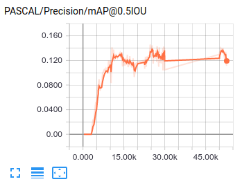 | 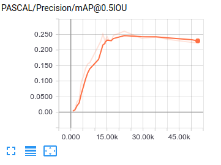

A similar mAP value [benchmark](https://books.google.com/books?id=aSEsDwAAQBAJ&pg=PA221&lpg=PA221&dq=GTSDB+mAP&source=bl&ots=hu7-LFfG2J&sig=paO26Fz5gn0fUuILg7RVnUSAYrI&hl=zh-CN&sa=X&ved=0ahUKEwiPiOPLr7vZAhWL5IMKHeFqBRkQ6AEIKjAA#v=onepage&q=GTSDB%20mAP&f=false) material can be found  with same faster method.

The main poor mAP value reason mentioned by benchmark material, due to the low amount of training images and lack of noise with the signs in the GTSRB images have. The benchmark also provided a solution through generating images with GTSRB and Road/Lane dataset.  

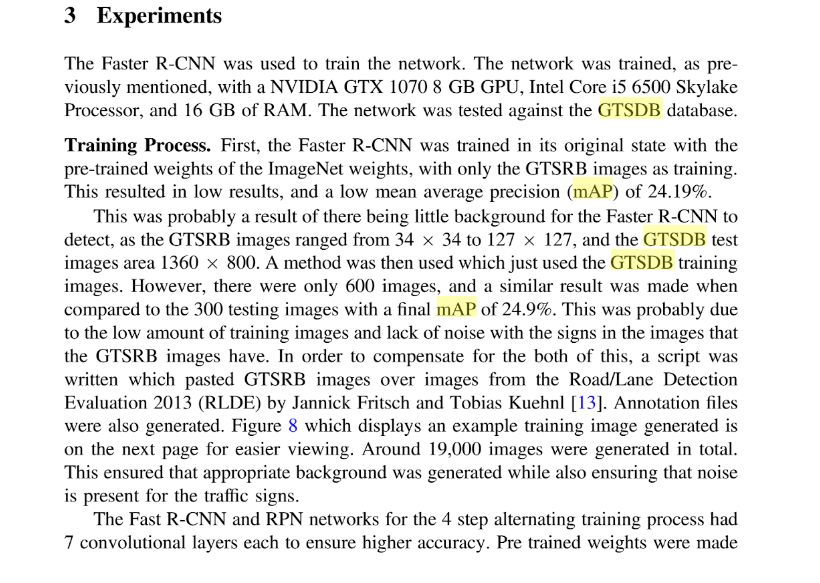

### Images
The detection results on test samples are impressive, especially for some images with small traffic signs.
* images detection examples

raw      |SSD      | faster
---      |---------|--------------
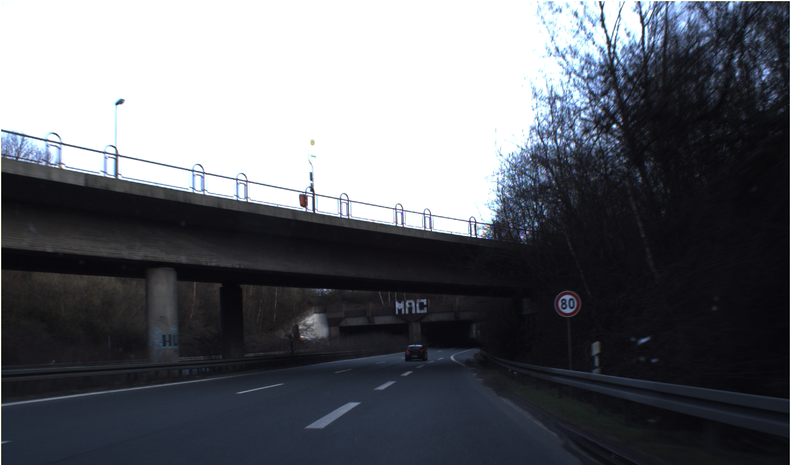    |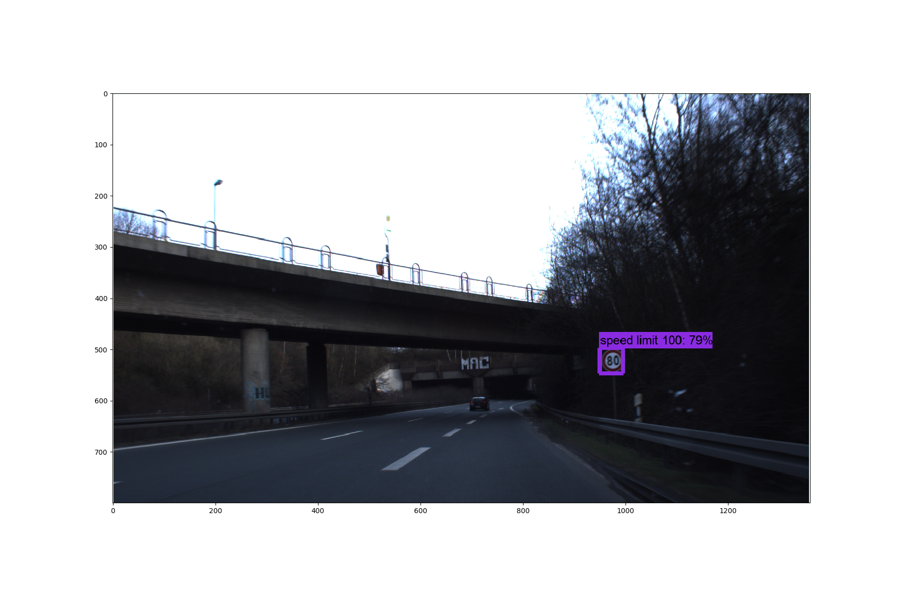 | 
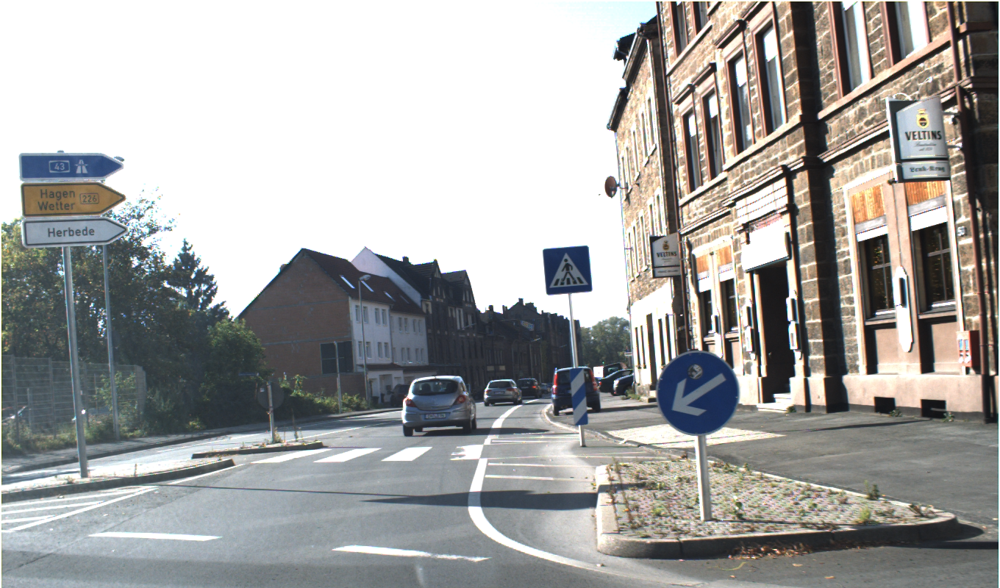    |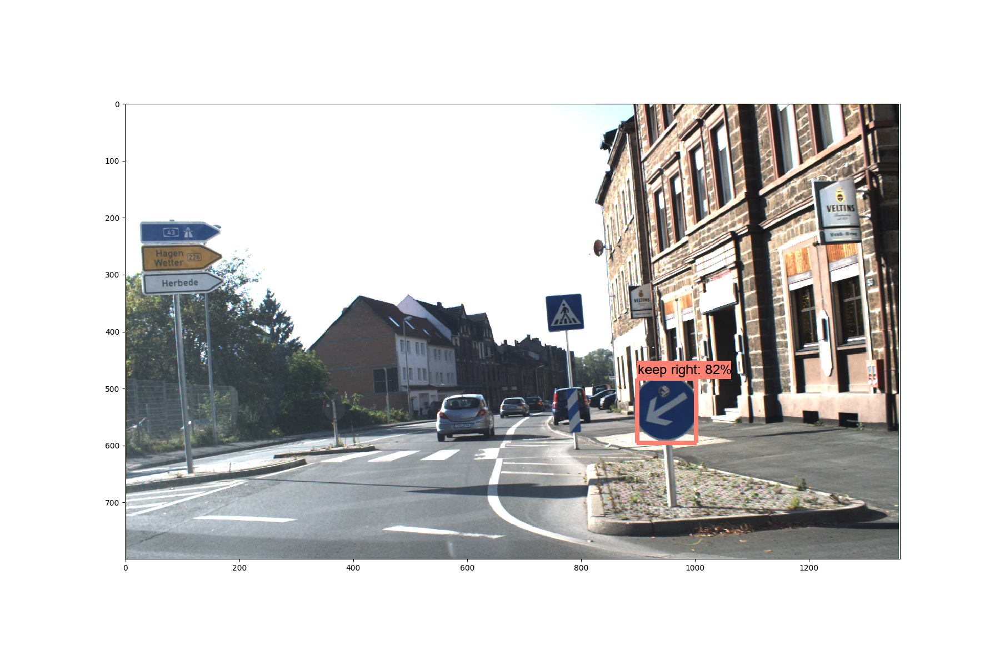 | 
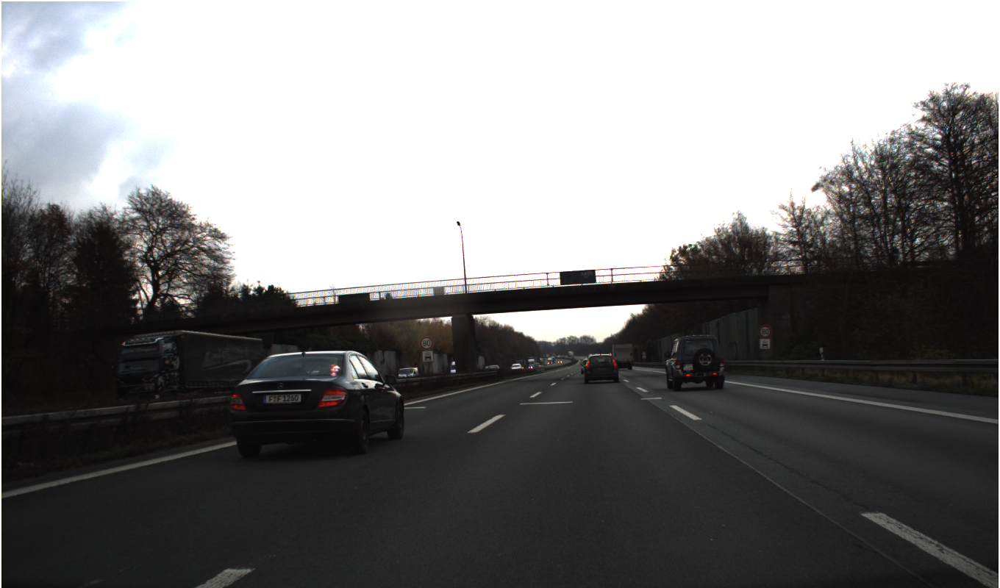    | | 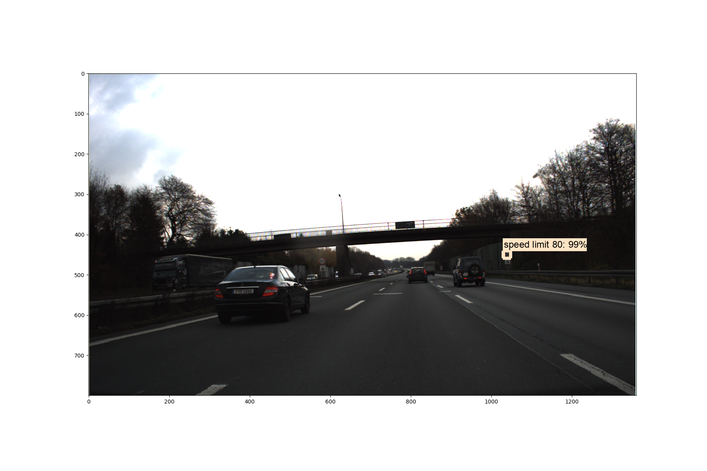
* images wrong or missing detection examples

raw      |SSD      | faster
---      |---------|--------------
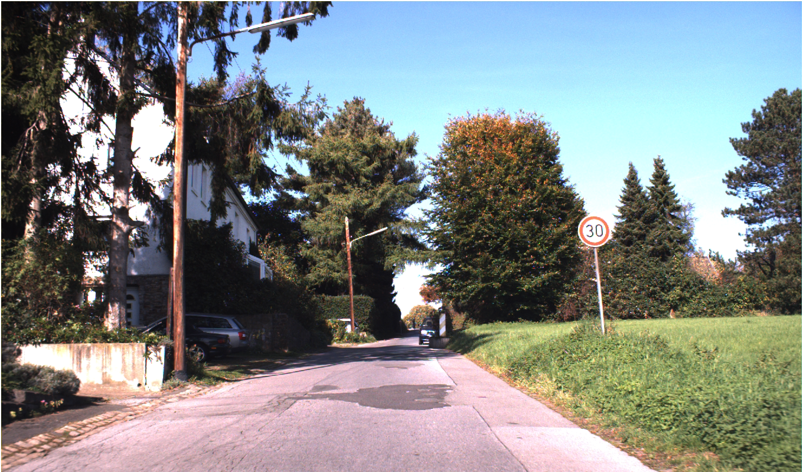    |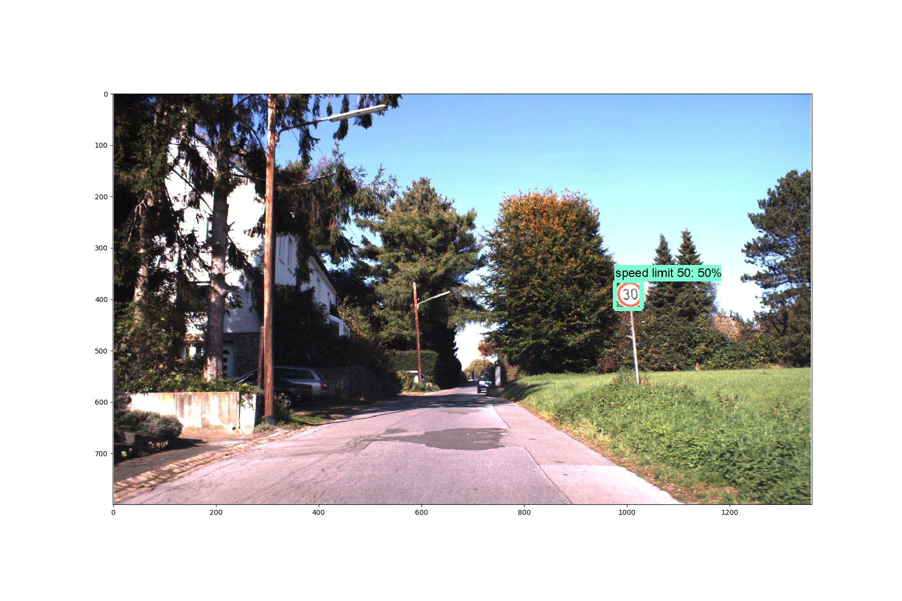 | 
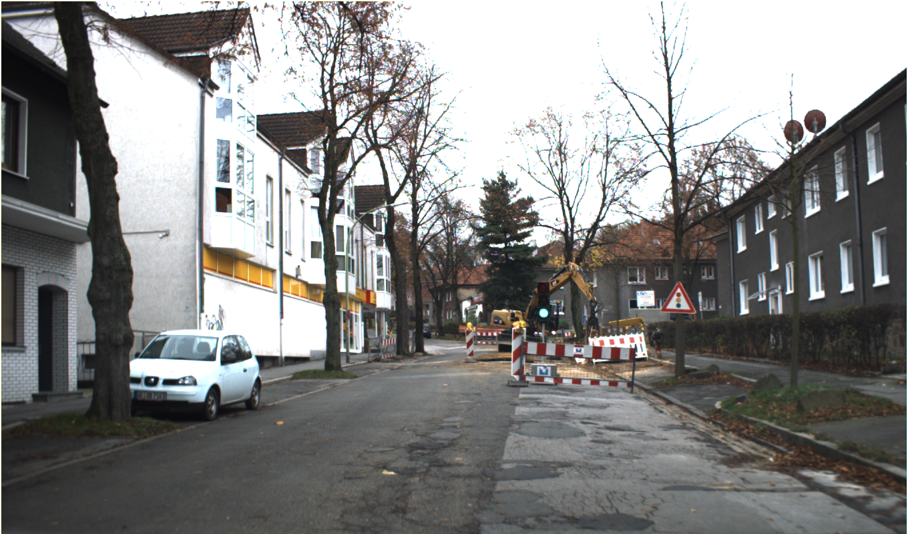    |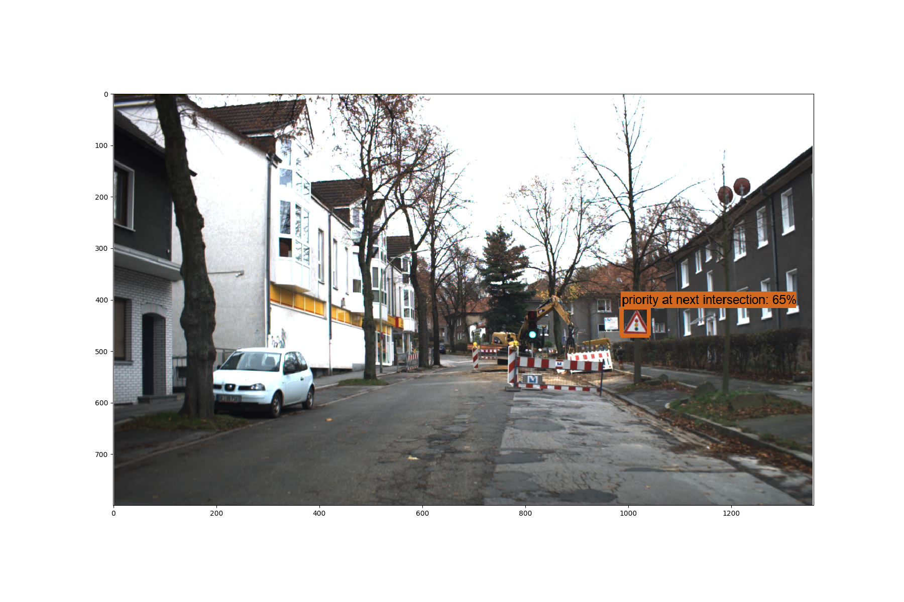 | 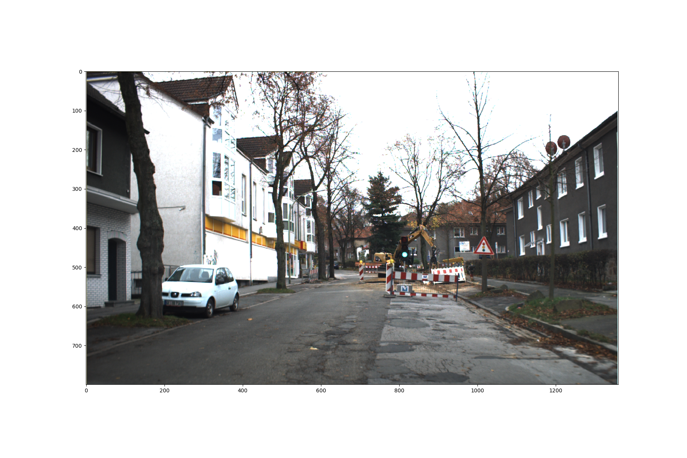
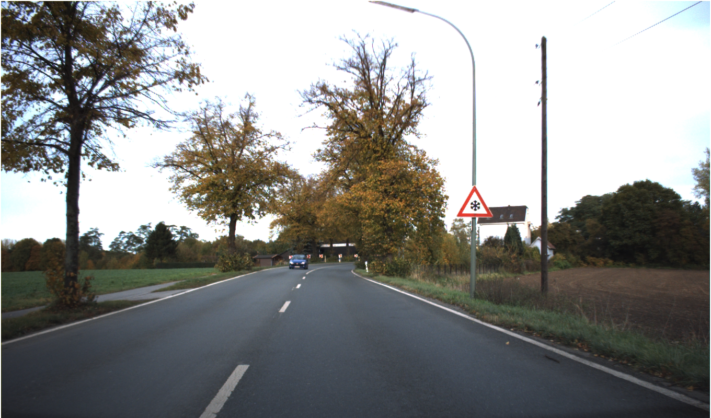    |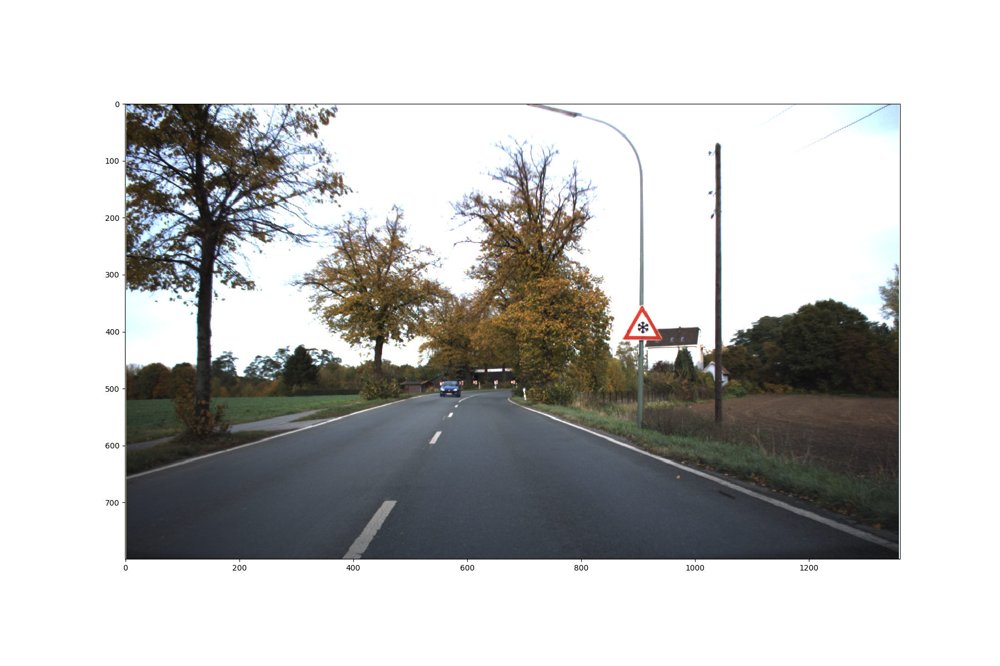 | 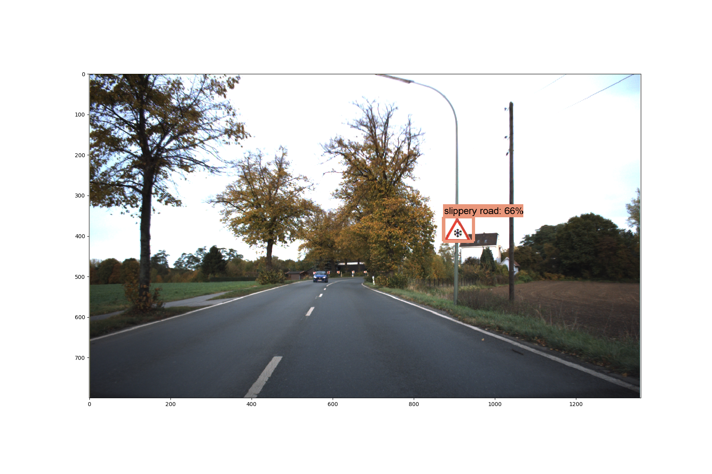

## Tensorflow Object Detection installation
This project is based on Tensorflow object detection.

`git clone https://github.com/tensorflow/models.git` is the first step.

[Tensorflow Object Detection API installation](https://github.com/tensorflow/models/blob/master/research/object_detection/g3doc/installation.md)

Please compile Protobuf libraries and add Libraries to PYTHONPATH before using Tensorflow object detection API framework.

```
# From tensorflow/models/research/
protoc object_detection/protos/*.proto --python_out=.

# From tensorflow/models/research/
export PYTHONPATH=$PYTHONPATH:`pwd`:`pwd`/slim
```
## Data analysis

The German Traffic Sign Detection Benchmark is a single-image detection assessment for researchers with interest in the field of computer vision, pattern recognition and image-based driver assistance. There are total 900 images and 43 classes traffic signs shown below.
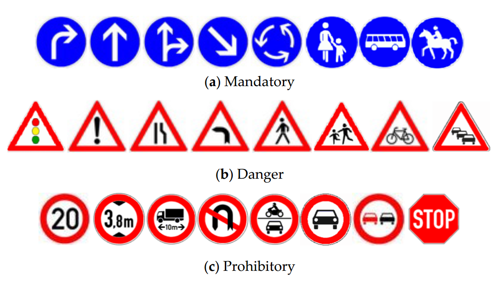

GTSDB dataset distribution is shown below and detail script in [jupyter notebook](). There is data imbalance and some classes image numbers are rare.

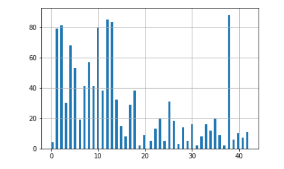

## Create record
Download GTSDB full dataset and then follow jupyter notebook to split dataset, then create record files for tensorflow object detection.

Please pay more attention to modify file path in config and jupyter notebook files for the difference between your file structure and this project.  

Most of training have been on aws g2x8 about 48 hours for each model.   

## Training
[Reference Tensorflow object detection user guide](https://github.com/tensorflow/models/blob/master/research/object_detection/g3doc/running_locally.md)

## SSD vs Faster rcnn
In summary faster rcnn model works better than ssd model.
Others models maybe do better but need more calculation capacity and time, and ignored here.

## More
There are a lot of improvements can be done in the future for traffic signs detection in order make self driving car to see the world more accuracy and real time.

* One possible is to focus on some sub group of traffic signs which are more crucial for driving with current limited dataset.

* If model detects two green lights from front camera images, there should be a pipeline to determine which light should be used.

* The model also should be trained to detect traffic policemen's command by gesture.

## Resources
[Traffic-Sign Detection and Classification in the Wild](http://cg.cs.tsinghua.edu.cn/traffic-sign/)

[sridhar912 Traffic Sign Detection and Classification](https://github.com/sridhar912/tsr-py-faster-rcnn)

[Detect and Classify Species of Fish from Fishing Vessels with Modern Object Detectors and Deep Convolutional Networks](https://flyyufelix.github.io/2017/04/16/kaggle-nature-conservancy.html)

[A Real-Time Chinese Traffic Sign Detection Algorithm Based on Modified YOLOv2](http://www.mdpi.com/1999-4893/10/4/127/htm)

[Cognitive Systems and Signal Processing page 220](https://books.google.com/books?id=aSEsDwAAQBAJ&pg=PA221&lpg=PA221&dq=GTSDB+mAP&source=bl&ots=hu7-LFfG2J&sig=paO26Fz5gn0fUuILg7RVnUSAYrI&hl=zh-CN&sa=X&ved=0ahUKEwiPiOPLr7vZAhWL5IMKHeFqBRkQ6AEIKjAA#v=onepage&q=GTSDB%20mAP&f=false)

## Licenses
German traffic signs detection specific code is distributed under MIT License.
